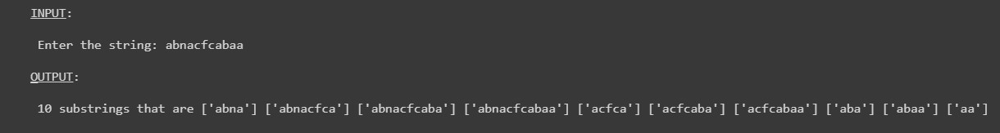

# Coding-Club: 
# Skillful-Saturdays

### About:
A Coding Competition called "Skillful Saturday" that is organized by the Coding Club of the Computer Engineering Department.

> Programming Language used is **Python**   

### Problems:  
> CLick on Problem Name to see how the problem was solved.  

1. [Strings and Sub Strings](https://github.com/Amoeba5558/Coding-Club_Skillful-Saturdays/blob/main/Problem-01.py)  
* Problem Description :  
Given an alphabetic string S. The task is to count the number of sub-strings that starts and end with "a".  
Note: The starting and the ending "a" should be different and the size of sub-string can be anything but more than 1.    
 Problem Input : "`abnacfcabaa`"  
 Problem Output :  

